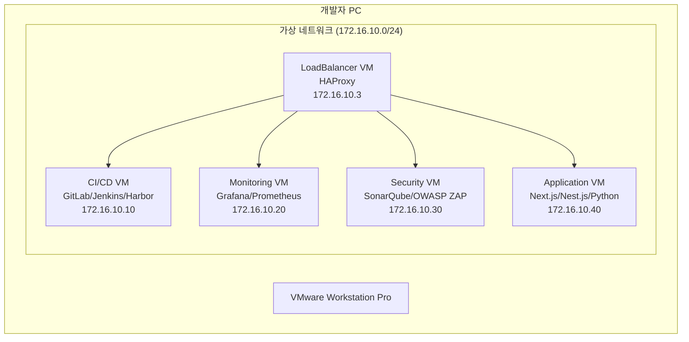

# MSA 개발/운영 환경 구성 가이드

## 1. 시스템 구성도


## 2. 설치 및 실행 순서

### 2.1 기본 환경 구성 (모든 VM 공통)
```bash
# 시스템 업데이트
sudo apt update && sudo apt upgrade -y

# Docker 설치
curl -fsSL https://get.docker.com | sudo sh
sudo usermod -aG docker $USER

# 기본 디렉토리 생성
sudo mkdir -p /data/{certs,logs}
sudo chmod 700 /data/certs
sudo chmod 755 /data/logs
```

### 2.2 각 VM 구성 순서
1. LoadBalancer VM (172.16.10.3)
   - SSL 인증서 생성
   - HAProxy 구성
   - 도메인 라우팅 설정

2. CI/CD VM (172.16.10.10)
   - GitLab
   - Harbor
   - Jenkins

3. Monitoring VM (172.16.10.20)
   - Prometheus
   - Grafana
   - Node Exporter

4. Security VM (172.16.10.30)
   - SonarQube
   - OWASP ZAP

5. Application VM (172.16.10.40)
   - Next.js Demo
   - Nest.js Demo
   - Python Demo

### 2.3 실행 명령어
```bash
# 1. LoadBalancer VM
cd ~/docker-compose/loadbalancer/docker
cp ../.env.sample ../.env
docker compose up -d

# 2. CI/CD VM
cd ~/docker-compose/cicd/docker
cp ../.env.sample ../.env
docker compose up -d

# 3. Monitoring VM
cd ~/docker-compose/monitoring/docker
cp ../.env.sample ../.env
docker compose up -d

# 4. Security VM
cd ~/docker-compose/security/docker
cp ../.env.sample ../.env
docker compose up -d

# 5. Application VM
cd ~/docker-compose/application/docker
cp ../.env.sample ../.env
docker compose up -d
```

## 3. 시스템 요구사항
- 호스트 PC
  - CPU: 최소 16코어 (권장 20코어)
  - 메모리: 최소 32GB (권장 64GB)
  - 디스크: 최소 500GB
  - OS: Windows 10/11 Pro 이상
  
- VM 별 스펙
  - LoadBalancer VM: 2 CPU, 2GB RAM, 40GB Disk
  - CI/CD VM: 6 CPU, 12GB RAM, 100GB Disk
  - Monitoring VM: 2 CPU, 4GB RAM, 60GB Disk
  - Security VM: 2 CPU, 4GB RAM, 60GB Disk
  - Application VM: 4 CPU, 8GB RAM, 80GB Disk

## 4. Git 저장소 설정
```bash
# 소스 코드 다운로드
git clone https://github.com/cnf-kunkin/docker-compose.git
cd docker-compose

# 변경사항 커밋 및 푸시
git add .
git commit -m "feat: 환경 설정 변경"
git push origin main
```

## 5. 디렉토리 구조
```bash
docker-compose/
├── loadbalancer/     # 1단계: LoadBalancer VM
├── cicd/            # 2단계: CI/CD VM
├── monitoring/      # 3단계: Monitoring VM
├── security/        # 4단계: Security VM
└── application/     # 5단계: Application VM
```

## 6. 도메인 구성
- LoadBalancer: haproxy.local
- CI/CD: gitlab.local, jenkins.local, harbor.local
- Monitoring: grafana.local, prometheus.local
- Security: sonarqube.local, security.local
- Application: next-demo.local, nest-demo.local, python-demo.local
