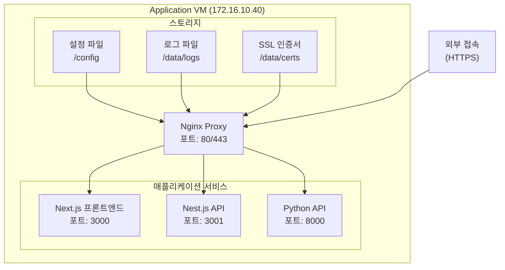

# Application VM 구성 가이드

## 1. 시스템 구성도


## 2. 준비 사항
### 2.1 시스템 요구사항
- VMware Workstation/Player 설치됨
- VM 스펙:
  - CPU: 4코어
  - 메모리: 8GB
  - 디스크: 80GB
  - OS: Ubuntu 24.04 Server
  - IP: 172.16.10.40

### 2.2 사전 설치
```bash
# 시스템 업데이트
sudo apt update && sudo apt upgrade -y

# 기본 도구 설치
sudo apt install -y curl git vim net-tools

# Docker 설치
curl -fsSL https://get.docker.com | sudo sh
sudo usermod -aG docker $USER

# Docker Compose 설치
sudo apt install -y docker-compose-plugin
```

## 3. 설치 과정

### 3.1 프로젝트 클론
```bash
# 홈 디렉토리로 이동
cd ~

# Git 저장소 클론
git clone <repository-url> docker-compose
cd docker-compose/application
```

### 3.2 디렉토리 구조 생성
```bash
# 필요한 디렉토리 생성
sudo mkdir -p /data/{certs,logs}/{nginx,nextjs,nestjs,python}
mkdir -p config/nginx/{conf.d,ssl}
mkdir -p apps/{nextjs,nestjs,python}

# 권한 설정
sudo chown -R $USER:$USER /data
sudo chmod -R 755 /data
sudo chmod -R 700 /data/certs
```

### 3.3 환경변수 설정
```bash
# 환경변수 파일 생성
cp .env.sample .env

# 환경변수 파일 권한 설정
chmod 600 .env

# 환경변수 파일 수정
vim .env
```

### 3.4 SSL 인증서 설정
```bash
# 인증서 파일 복사
sudo cp /path/to/certificates/* /data/certs/

# 인증서 권한 설정
sudo chmod 600 /data/certs/*.key
sudo chmod 644 /data/certs/*.crt
```

### 3.5 애플리케이션 실행
```bash
# Docker Compose 실행
cd docker
docker compose up -d

# 로그 확인
docker compose logs -f
```

## 4. 동작 확인

### 4.1 서비스 상태 확인
```bash
# 컨테이너 상태 확인
docker compose ps

# 각 서비스 로그 확인
docker compose logs nginx
docker compose logs nextjs
docker compose logs nestjs
docker compose logs python
```

### 4.2 접속 테스트
1. hosts 파일에 도메인 추가 (/etc/hosts)
```bash
sudo vim /etc/hosts

# 추가할 내용
172.16.10.40 next-demo.local nest-demo.local python-demo.local
```

2. 브라우저에서 접속 테스트
- Next.js: https://next-demo.local
- Nest.js: https://nest-demo.local
- Python: https://python-demo.local

## 5. 문제 해결

### 5.1 일반적인 문제
1. 컨테이너가 시작되지 않는 경우
```bash
# 상세 로그 확인
docker compose logs -f [서비스명]

# 컨테이너 상태 확인
docker compose ps
```

2. 웹 페이지 접속이 안 되는 경우
```bash
# Nginx 설정 확인
docker compose exec nginx nginx -t

# SSL 인증서 확인
ls -la /data/certs/
```

### 5.2 성능 모니터링
```bash
# 컨테이너 리소스 사용량 모니터링
docker stats

# 로그 모니터링
tail -f /data/logs/nginx/error.log

# 디스크 사용량 확인
df -h /data
```

## 6. 보안 체크리스트
- [ ] SSL 인증서가 최신 상태인지 확인
- [ ] 환경변수에 민감한 정보가 없는지 확인
- [ ] 로그 파일의 권한이 적절한지 확인
- [ ] 컨테이너가 root로 실행되지 않는지 확인
- [ ] 불필요한 포트가 외부에 노출되지 않았는지 확인

## 7. 백업 및 복구
```bash
# 설정 파일 백업
tar -czf config_backup.tar.gz config/

# 데이터 볼륨 백업
docker run --rm \
  -v application_data:/data \
  -v $(pwd):/backup \
  alpine tar -czf /backup/data_backup.tar.gz /data
```
