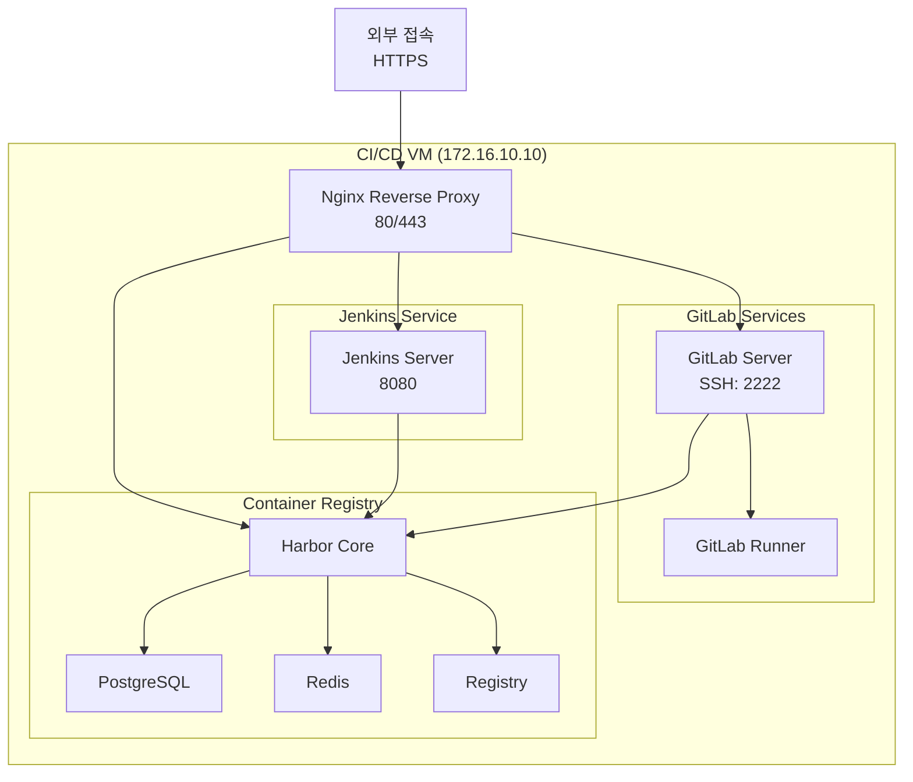

# CI/CD VM 구성 가이드

## 1. 시스템 구성도


## 2. 보안 강화 사항
1. GitLab 보안 설정
```bash
# GitLab 설정 수정
sudo vim /data/gitlab/config/gitlab.rb

# 추가할 설정
gitlab_rails['rack_attack_git_basic_auth'] = {
  'enabled' => true,
  'ip_whitelist' => ["172.16.10.0/24"],
  'maxretry' => 10,
  'findtime' => 60,
  'bantime' => 3600
}

# 2FA 강제 적용
gitlab_rails['gitlab_two_factor_auth_required'] = true
```

2. Jenkins 보안 설정
```bash
# Jenkins 권한 설정
sudo chown -R 1000:1000 /data/jenkins
sudo chmod -R 700 /data/jenkins

# 추가 보안 플러그인 설치
- Configuration as Code
- Role-based Authorization Strategy
- Audit Trail
- Security Inspector
```

3. Harbor 보안 강화
```bash
# Harbor 설정 수정
vim /data/harbor/config/harbor.yml

# 추가할 설정
security:
  vulnerability_scanning:
    enabled: true
  content_trust:
    enabled: true
```

## 3. 서비스 관리

### 3.1 상태 모니터링
```bash
# 서비스 상태 확인
docker compose ps
docker compose top

# 리소스 사용량 모니터링
docker stats

# 로그 모니터링
tail -f /data/logs/nginx/error.log
tail -f /data/logs/gitlab/gitlab-rails/production.log
tail -f /data/logs/jenkins/jenkins.log
```

### 3.2 백업 절차
```bash
# GitLab 백업
docker compose exec gitlab gitlab-backup create STRATEGY=copy

# Jenkins 백업
tar -czf jenkins_backup.tar.gz /data/jenkins

# Harbor 백업
docker compose exec harbor-db pg_dump -U postgres registry > harbor_db.sql
tar -czf harbor_backup.tar.gz /data/harbor
```

### 3.3 성능 최적화
```bash
# GitLab 메모리 최적화
gitlab_rails['env'] = {
    'MALLOC_ARENA_MAX' => '2',
    'RUBY_GC_HEAP_INIT_SLOTS' => 600000,
    'RUBY_GC_OLDMALLOC_LIMIT' => 59000000
}

# Jenkins 힙 메모리 설정
JAVA_OPTS="-Xmx2g -Xms512m -XX:MaxMetaspaceSize=512m"
```

## 4. 디렉토리 구조 생성
```bash
# 디렉토리 생성
sudo mkdir -p /data/{gitlab,jenkins,harbor,runner,certs,logs}
sudo mkdir -p config/{nginx,gitlab,jenkins,harbor}

# SSL 인증서 복사
sudo cp /data/certs/combined/*.pem /data/certs/
sudo cp /data/certs/*.crt /data/certs/
sudo cp /data/certs/*.key /data/certs/

# 권한 설정
sudo chown -R 1000:1000 /data/jenkins
sudo chown -R root:root /data/gitlab
sudo chmod -R 755 /data/harbor
sudo chmod 600 /data/certs/*.key /data/certs/*.pem
sudo chmod 644 /data/certs/*.crt
```

## 5. Nginx 설정
Nginx reverse proxy 설정을 통해 각 서비스로 트래픽을 라우팅합니다.

## 6. 서비스 실행
```bash
cd docker
docker compose up -d
```

## 7. 초기 설정
### 7.1 GitLab 초기 설정
- 브라우저에서 https://gitlab.local 접속
- 초기 root 비밀번호 확인:
```bash
docker exec -it gitlab cat /etc/gitlab/initial_root_password
```

### 7.2 Jenkins 초기 설정
- 브라우저에서 https://jenkins.local 접속
- 초기 관리자 비밀번호 확인:
```bash
docker exec -it jenkins cat /var/jenkins_home/secrets/initialAdminPassword
```

### 7.3 Harbor 초기 설정
- 브라우저에서 https://harbor.local 접속
- 기본 계정: admin / Harbor12345
```bash
# Docker 로그인
docker login harbor.local
```
