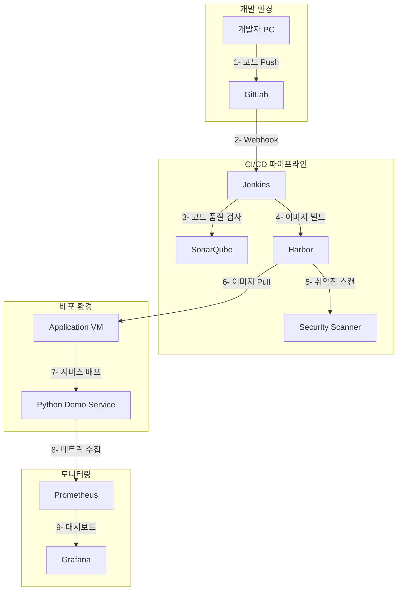

# MSA 기반 CICD 시스템 연동 가이드

## 1. 시스템 구성 개요

### 1.1 전체 시스템 아키텍처

### 1.2 시스템 접속 정보
| 서비스 | URL | 기본 계정 | 설명 |
|--------|-----|-----------|------|
| GitLab | https://gitlab.local | admin/password | 소스 코드 관리 |
| Jenkins | https://jenkins.local | admin/password | CI/CD 파이프라인 |
| Harbor | https://harbor.local | admin/Harbor12345 | 컨테이너 레지스트리 |
| SonarQube | https://sonarqube.local | admin/admin | 코드 품질 분석 |
| Grafana | https://grafana.local | admin/admin | 모니터링 대시보드 |
| Python Demo | https://python-demo.local | N/A | 데모 애플리케이션 |

### 1.3 실습 시나리오 개요
1. 사용자 계정 설정 및 권한 구성
2. Python 데모 애플리케이션 개발
3. GitLab 저장소 설정 및 코드 Push
4. Jenkins 파이프라인 구성
5. SonarQube 품질 게이트 설정
6. Harbor 레지스트리 연동
7. 애플리케이션 자동 배포
8. 모니터링 시스템 구성

## 2. 문서 구성
1. [초기 환경 구성](./01-initial-setup.md)
2. [사용자 계정 설정](./02-user-accounts.md)
3. [Python 데모 애플리케이션](./03-demo-application.md)
4. [GitLab 설정](./04-gitlab-setup.md)
5. [Jenkins 파이프라인](./05-jenkins-pipeline.md)
6. [SonarQube 연동](./06-sonarqube-integration.md)
7. [Harbor 레지스트리](./07-harbor-registry.md)
8. [애플리케이션 배포](./08-application-deployment.md)
9. [모니터링 구성](./09-monitoring-setup.md)
10. [통합 테스트](./10-integration-test.md)

## 3. 사전 준비사항
- VMware Workstation Pro 설치
- 모든 VM 생성 및 기본 설정 완료
- 호스트 PC의 hosts 파일 설정
- 네트워크 연결 확인

## 4. 버전 정보
- Ubuntu: 24.04 LTS
- Docker: 28.0.4
- Docker Compose: 2.34.0
- GitLab: CE 최신 버전
- Jenkins: LTS
- SonarQube: Latest
- Harbor: v2.12.2
- Python: 3.12
- Prometheus: Latest
- Grafana: Latest