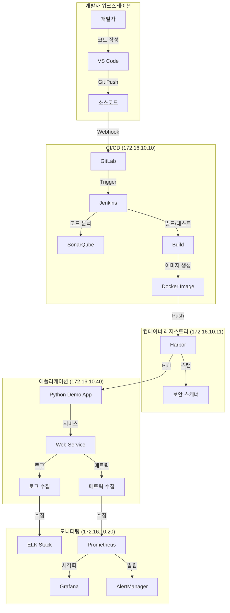
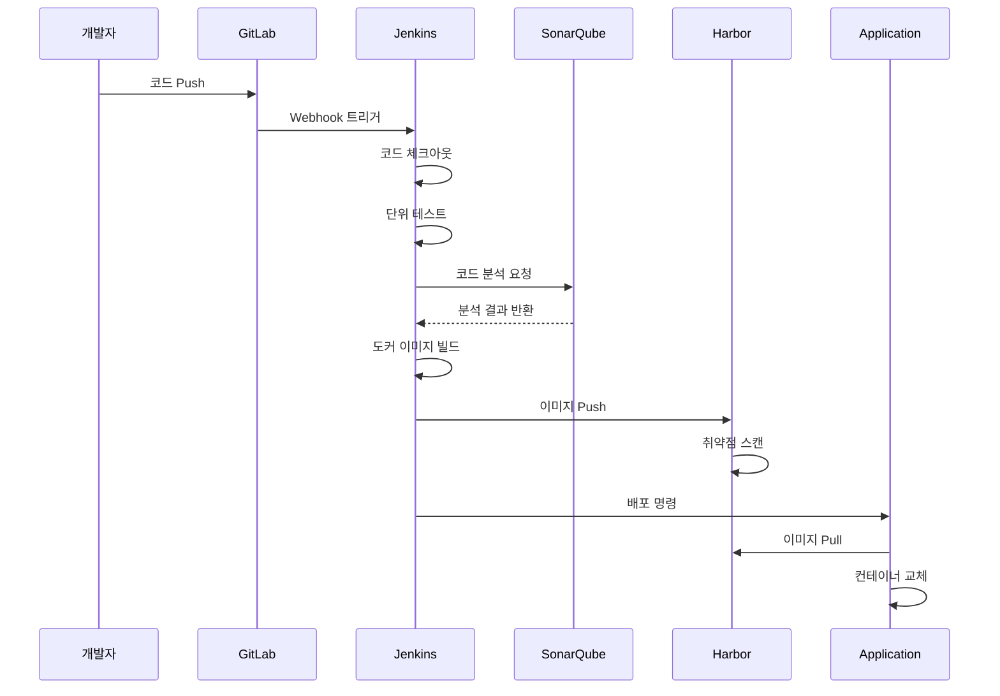
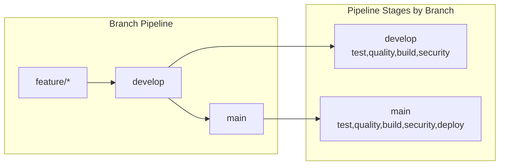
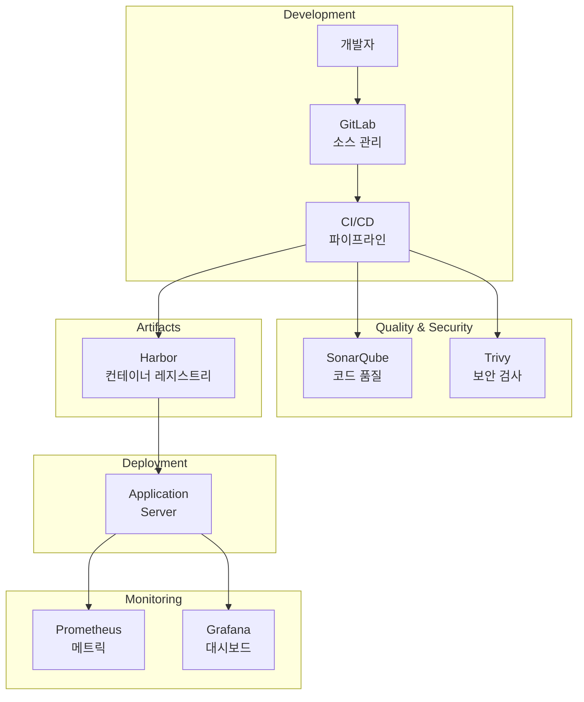
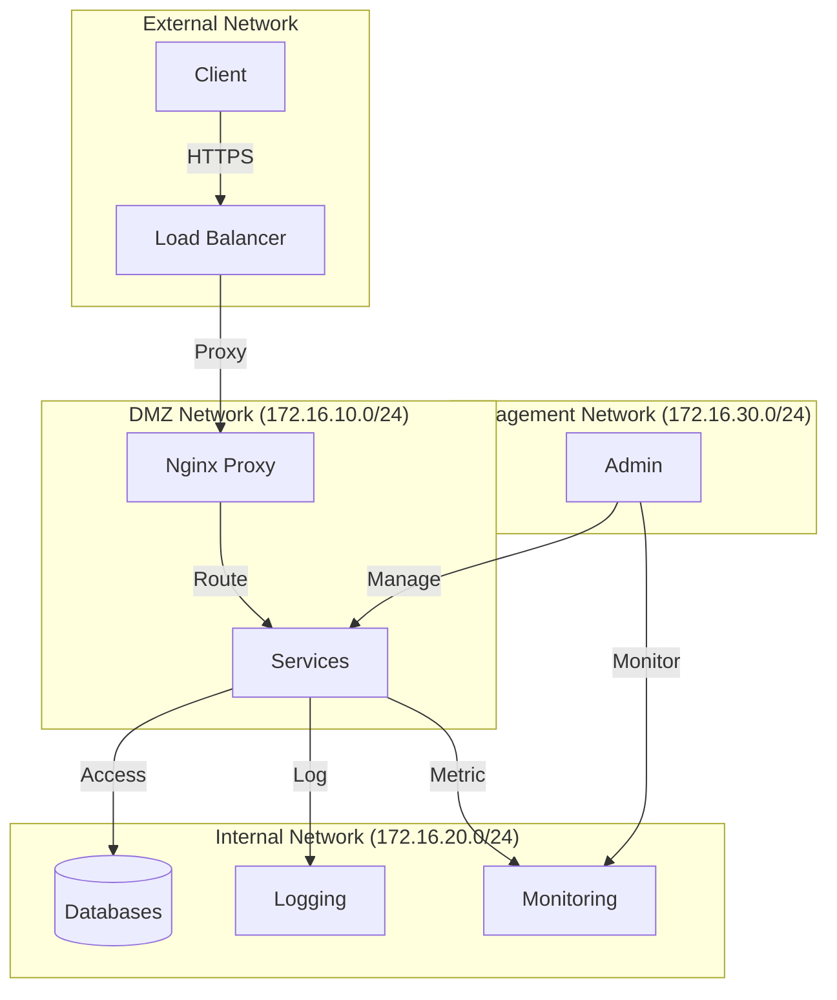
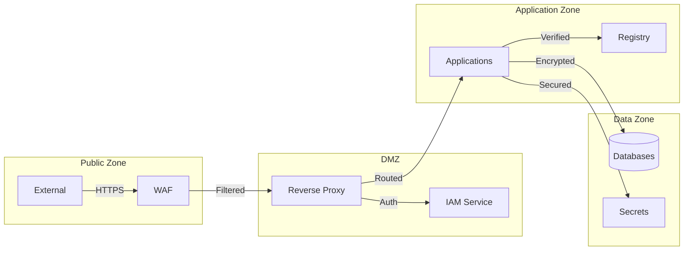
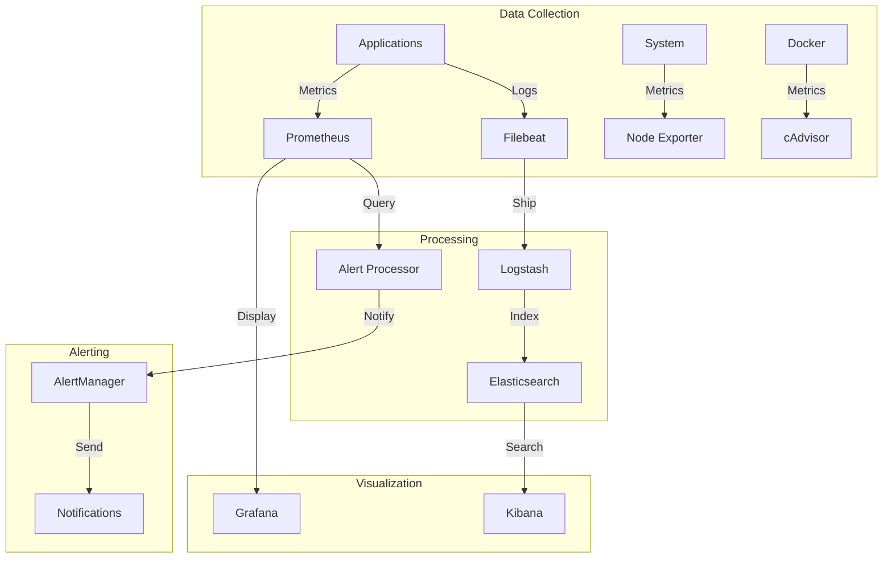
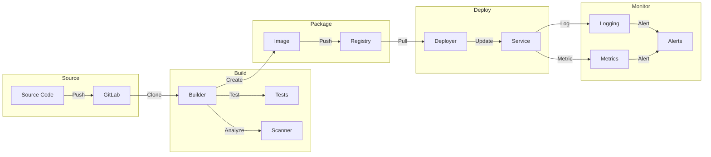

# CICD 시스템 아키텍처

## 1. 전체 시스템 구성도



## 2. CI/CD 파이프라인 흐름도



# CI/CD 파이프라인 구조

## 1. 파이프라인 단계 다이어그램

```mermaid
graph TB
    subgraph "CI/CD Pipeline Stages"
        A[테스트<br/>test] --> B[품질 검사<br/>quality]
        B --> C[빌드<br/>build]
        C --> D[보안 검사<br/>security]
        D --> E[배포<br/>deploy]
    end

    subgraph "테스트 단계"
        A1[npm install] --> A2[npm test]
    end

    subgraph "품질 검사 단계"
        B1[SonarQube<br/>분석 실행] --> B2[코드 품질<br/>리포트 생성]
    end

    subgraph "빌드 단계"
        C1[Docker 이미지<br/>빌드] --> C2[Harbor 레지스트리<br/>로그인] --> C3[이미지 푸시]
    end

    subgraph "보안 검사 단계"
        D1[Trivy를 사용한<br/>이미지 취약점 스캔]
    end

    subgraph "배포 단계"
        E1[SSH 키 설정] --> E2[배포 설정<br/>복사] --> E3[컨테이너<br/>재배포]
    end
```



## 2. 환경 변수 구성

```yaml
주요 환경 변수:
- DOCKER_REGISTRY: harbor.local
- DOCKER_IMAGE: ${DOCKER_REGISTRY}/${CI_PROJECT_PATH}
- DOCKER_TAG: ${CI_COMMIT_SHA}
- SSH_USER: devops
- APP_SERVER: 172.16.10.40
```

## 3. 단계별 상세 설명

### 3.1 테스트 단계 (Test)
- **목적**: 애플리케이션의 기능적 정확성 검증
- **실행 조건**: main 또는 develop 브랜치
- **주요 작업**:
  - npm 패키지 설치
  - 단위 테스트 실행

### 3.2 품질 검사 단계 (Quality)
- **목적**: 코드 품질 분석
- **사용 도구**: SonarQube
- **검사 항목**:
  - 코드 중복
  - 코드 복잡도
  - 코딩 표준 준수
  - 버그 가능성
  - 보안 취약점

### 3.3 빌드 단계 (Build)
- **목적**: 도커 이미지 생성 및 저장
- **작업 순서**:
  1. Dockerfile을 사용한 이미지 빌드
  2. Harbor 레지스트리 인증
  3. 빌드된 이미지 푸시

### 3.4 보안 검사 단계 (Security)
- **목적**: 컨테이너 이미지 보안 취약점 검사
- **사용 도구**: Trivy
- **검사 대상**: 빌드된 도커 이미지
- **검사 항목**:
  - OS 패키지 취약점
  - 언어별 의존성 패키지 취약점
  - 설정 오류

### 3.5 배포 단계 (Deploy)
- **목적**: 프로덕션 환경에 애플리케이션 배포
- **실행 조건**: main 브랜치만 해당
- **배포 프로세스**:
  1. SSH 접속 환경 구성
  2. 배포 설정 파일 전송
  3. 컨테이너 재배포
  4. 이전 이미지 정리

## 4. 브랜치별 파이프라인 동작



## 5. 통합 아키텍처



## 6. 파이프라인 실행 흐름

1. **소스 코드 푸시**
   - 개발자가 GitLab에 코드 푸시
   - 브랜치에 따른 파이프라인 트리거

2. **테스트 및 품질 검사**
   - 단위 테스트 실행
   - SonarQube 코드 분석
   - 품질 게이트 확인

3. **컨테이너 이미지 생성**
   - Dockerfile 기반 빌드
   - 이미지 태깅
   - Harbor 레지스트리 업로드

4. **보안 취약점 검사**
   - Trivy를 통한 이미지 스캔
   - 취약점 리포트 생성
   - 심각도별 조치

5. **운영 환경 배포**
   - main 브랜치 검증
   - SSH를 통한 원격 배포
   - 무중단 배포 수행
   - 배포 상태 확인

## 7. SSH 키 설정 가이드

### 7.1 SSH_PRIVATE_KEY 생성 및 등록

1. **SSH 키 생성**
```bash
# 배포 서버용 SSH 키 생성
ssh-keygen -t rsa -b 4096 -C "deployment-key" -f ./deploy_key

# 생성된 private key 내용 확인 (GitLab CI/CD 변수에 등록할 내용)
cat deploy_key

# public key 내용 확인 (배포 서버에 등록할 내용)
cat deploy_key.pub
```

2. **배포 서버에 public key 등록**
```bash
# 배포 서버의 authorized_keys에 public key 추가
echo "[deploy_key.pub 내용]" >> ~/.ssh/authorized_keys
```

3. **GitLab CI/CD 변수에 private key 등록**
- GitLab 프로젝트 > Settings > CI/CD > Variables
- Add Variable 선택
- Key: SSH_PRIVATE_KEY
- Value: deploy_key 파일의 내용 전체
- Type: File
- Protected: Yes 선택
- Masked: Yes 선택

### 7.2 SSH_KNOWN_HOSTS 설정

1. **배포 서버의 known_hosts 항목 생성**
```bash
# 배포 서버 호스트키 스캔 (예: 172.16.10.40)
ssh-keyscan -H 172.16.10.40

# 또는 도메인을 사용하는 경우
ssh-keyscan -H your-server.domain.com
```

2. **GitLab CI/CD 변수에 known_hosts 등록**
- GitLab 프로젝트 > Settings > CI/CD > Variables
- Add Variable 선택
- Key: SSH_KNOWN_HOSTS
- Value: ssh-keyscan 명령어의 출력 결과
- Type: Variable
- Protected: No 선택
- Masked: No 선택

### 7.3 SSH 키 검증

1. **로컬에서 SSH 연결 테스트**
```bash
# 생성한 키로 SSH 접속 테스트
ssh -i deploy_key devops@172.16.10.40
```

2. **배포 스크립트에서 사용되는 SSH 설정**
```yaml
deploy:
  stage: deploy
  before_script:
    - 'command -v ssh-agent >/dev/null || ( apt-get update -y && apt-get install openssh-client -y )'
    - eval $(ssh-agent -s)
    - echo "$SSH_PRIVATE_KEY" | tr -d '\r' | ssh-add -
    - mkdir -p ~/.ssh
    - chmod 700 ~/.ssh
    - echo "$SSH_KNOWN_HOSTS" >> ~/.ssh/known_hosts
    - chmod 644 ~/.ssh/known_hosts
  script:
    - scp docker-compose.prod.yml $SSH_USER@$APP_SERVER:/data/app/
    # ... 이하 배포 스크립트 ...
```

### 7.4 보안 주의사항

1. **SSH 키 관리**
   - Private key는 절대 소스 코드에 포함하지 않음
   - GitLab CI/CD 변수는 반드시 Protected로 설정
   - 정기적인 키 로테이션 수행

2. **권한 설정**
   - SSH 키 파일 권한: 600
   - .ssh 디렉토리 권한: 700
   - known_hosts 파일 권한: 644

3. **모니터링**
   - SSH 접속 로그 모니터링
   - 비정상 접근 시도 탐지
   - 키 사용 내역 감사

## 3. 네트워크 구성도



## 4. 보안 아키텍처



## 5. 모니터링 아키텍처



## 6. 데이터 흐름도



각 다이어그램은 다음과 같은 목적으로 설계되었습니다:

1. 전체 시스템 구성도: 시스템의 전반적인 구조와 컴포넌트 간의 관계를 보여줍니다.
2. CI/CD 파이프라인 흐름도: 코드 변경부터 배포까지의 전체 과정을 시간 순으로 보여줍니다.
3. 네트워크 구성도: 시스템의 네트워크 분리와 보안 구성을 보여줍니다.
4. 보안 아키텍처: 보안 관련 컴포넌트와 데이터 보호 방식을 보여줍니다.
5. 모니터링 아키텍처: 시스템 모니터링과 알림 구성을 보여줍니다.
6. 데이터 흐름도: 데이터가 시스템 내에서 어떻게 이동하고 처리되는지 보여줍니다.
7. CI/CD 파이프라인 구조: 파이프라인 단계와 각 단계의 상세 설명을 포함하여 CI/CD 프로세스를 명확히 합니다.
