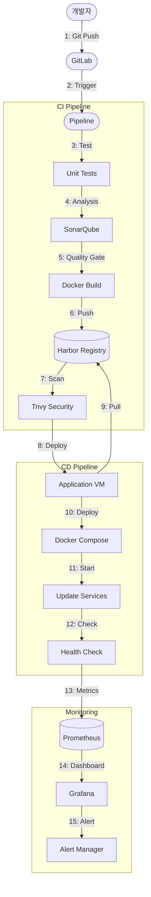
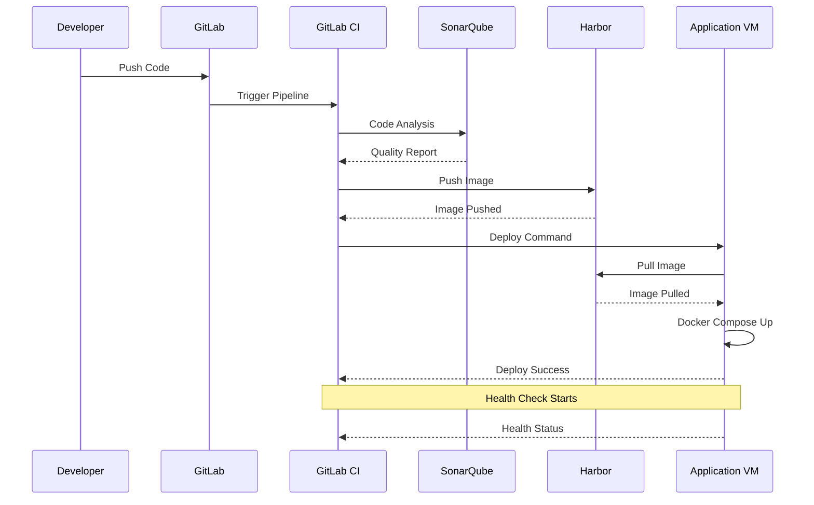

# CI/CD 파이프라인 흐름도

## 1. 전체 프로세스

## 2. 단계별 세부 설명

### CI (Continuous Integration)
1. **코드 커밋**
   - 개발자가 GitLab에 코드 Push
   - `.gitlab-ci.yml` 파일 감지

2. **테스트 실행**
   - 단위 테스트
   - 통합 테스트
   - 커버리지 검사

3. **코드 품질 검사**
   - SonarQube 정적 분석
   - 코드 품질 메트릭 수집
   - Quality Gate 검사

4. **컨테이너 빌드**
   - Dockerfile 기반 이미지 생성
   - 멀티스테이지 빌드 최적화
   - 레이어 캐시 활용

5. **보안 검사**
   - Trivy 취약점 스캔
   - 컨테이너 이미지 검증
   - CVE 데이터베이스 확인

### CD (Continuous Deployment)
1. **배포 준비**
   - Harbor에서 이미지 Pull
   - 환경변수 구성
   - 볼륨 마운트 준비

2. **서비스 배포**
   - Docker Compose 실행
   - 무중단 배포 (Blue/Green)
   - 상태 확인 및 롤백 준비

3. **모니터링**
   - 메트릭 수집 (Prometheus)
   - 대시보드 표시 (Grafana)
   - 알림 설정 (Alert Manager)

## 3. 주요 통신 흐름

