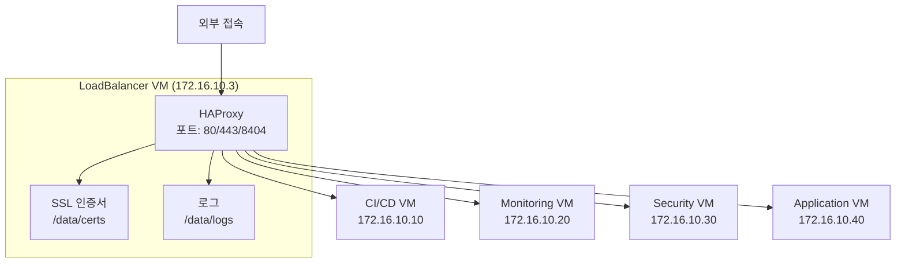

# LoadBalancer VM 설정 가이드

## 1. 시스템 구성도


## 2. 디렉토리 구조

```bash
/data/
├── certs/
│   └── combined/          # SSL 인증서
├── haproxy/
│   ├── logs/             # HAProxy 로그
│   └── lib/              # HAProxy 데이터
└── logs/                 # 일반 로그

# 디렉토리 생성 및 권한 설정
sudo mkdir -p /data/{certs/combined,haproxy/{logs,lib},logs}
sudo chown -R root:root /data/haproxy
sudo chmod 775 /data/haproxy
sudo chmod 775 /data/haproxy/logs
sudo setfacl -R -m u:haproxy:rwx /data/haproxy/logs
```


## 3. SSL 인증서 설정
```bash
# 인증서 생성
cd /data
cp ~/loadbalancer/config/ssl/generate-certs.sh /data/
chmod +x generate-certs.sh
sudo ./generate-certs.sh

# 권한 설정
sudo chown -R root:root /data/certs
sudo chmod -R 644 /data/certs/combined/*.pem
sudo chmod 755 /data/certs/combined
```

## 5. 서비스 관리
```bash
# 서비스 시작
 cd ~/loadbalancer/docker/
docker compose up -d

# 서비스 상태 확인
docker compose ps

# 설정 리로드
docker compose exec haproxy haproxy -sf $(pidof haproxy)
```

## 6. 모니터링
```bash
# 연결 상태 확인
watch 'netstat -ant | grep ESTABLISHED | wc -l'

# 리소스 사용량
docker stats haproxy

# 로그 모니터링
tail -f /data/haproxy/logs/haproxy.log
```

## 7. 문제 해결

### 7.1 인증서 오류
```bash
# 인증서 경로 확인
ls -l /data/certs/combined/

# 인증서 권한 확인
sudo chmod 644 /data/certs/combined/*.pem
sudo chmod 755 /data/certs/combined
```

### 7.2 권한 문제
```bash
# HAProxy 데이터 디렉토리 권한
sudo chown -R 99:99 /data/haproxy
sudo chmod 755 /data/haproxy

# 로그 디렉토리 권한
sudo chown -R 99:99 /data/haproxy/logs
```


## 4. HAProxy 설정 확인

### 4.1 설정 테스트
```bash
# 컨테이너 내부에서 설정 확인
docker compose exec haproxy haproxy -c -f /usr/local/etc/haproxy/haproxy.cfg

# 로그 확인
docker compose logs -f
```

### 4.2 상태 페이지
- URL: https://haproxy.local:8404/stats
- 기본 계정: admin/changeme