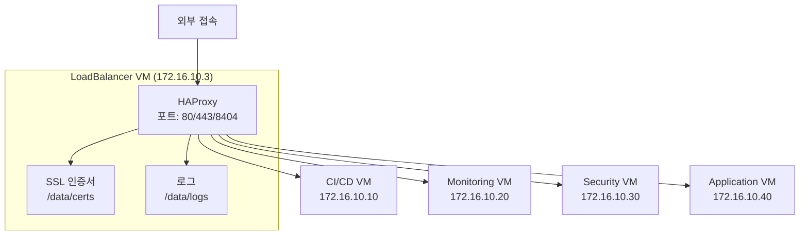

# LoadBalancer VM 설정 가이드

## 소스코드 가져오기
LoadBalancer 환경만 선택적으로 클론하기:
```bash
# 1. 빈 저장소 초기화
git init docker-compose
cd docker-compose
git remote add origin https://github.com/cnf-kunkin/docker-compose.git

# 2. LoadBalancer 디렉토리만 가져오기
git sparse-checkout init
git sparse-checkout set loadbalancer
git pull origin main

# 3. LoadBalancer 디렉토리로 이동
cd loadbalancer
```

## 1. 시스템 구성도


## 1.1 HAProxy 포트 구성

| 포트 | 프로토콜 | 용도 |
|------|----------|------|
| 80 | HTTP | 일반 웹 트래픽 처리 |
| 443 | HTTPS | 암호화된 웹 트래픽 처리 |
| 8404 | HTTP | HAProxy 상태 모니터링 페이지 |

## 2. 디렉토리 구조 및 권한 설정

```bash
# 기본 디렉토리 생성
sudo mkdir -p /data/{certs/combined,haproxy/{logs,lib,data},logs}

# HAProxy 사용자 및 그룹 생성 (Docker 컨테이너의 기본 UID/GID 사용)

# 소유권 설정
sudo chown -R root:root /data/certs
sudo chown -R 99:99 /data/haproxy
sudo chown -R syslog:adm /data/logs

# 권한 설정
sudo chmod 755 /data/certs/combined
sudo chmod -R 755 /data/haproxy
sudo chmod -R 755 /data/logs


# HAProxy 실행 디렉토리 생성
sudo mkdir -p /var/run/haproxy
sudo chown 99:99 /var/run/haproxy
sudo chmod 755 /var/run/haproxy
```

## 3. SSL 인증서 설정
```bash
# 인증서 생성
cd /data
sudo cp /home/ubuntu/docker-compose/loadbalancer/config/ssl/generate-certs.sh /data/
sudo chmod +x generate-certs.sh
sudo ./generate-certs.sh

```

## 설정 파일 생성
```bash
# 환경변수 파일 생성
cd ~/docker-compose/loadbalancer/
cp .env.sample .env

# 환경변수 파일 수정
cat > .env << EOF
# HAProxy 상태 페이지 설정
HAPROXY_STATS_PORT=8404
HAPROXY_STATS_USER=admin
HAPROXY_STATS_PASSWORD=admin  # 실제 환경에서 변경 필요
EOF

```

## 5. 서비스 관리
```bash
# 서비스 시작
cd ~/docker-compose/loadbalancer/docker/
docker compose up -d

```

# 서비스 확인 및 관리

## 1. 서비스 상태 확인
```bash
# 컨테이너 상태 확인
cd ~/docker-compose/loadbalancer/docker/
docker compose ps

# 실시간 로그 확인
docker compose logs -f

# 컨테이너 리소스 사용량 모니터링
docker stats haproxy
```

## 2. HAProxy 서비스 동작 확인
```bash
# HAProxy 프로세스 확인
docker compose exec haproxy ps aux | grep haproxy

# HAProxy 설정 파일 검증
docker compose exec haproxy haproxy -c -f /usr/local/etc/haproxy/haproxy.cfg

# Stats 페이지 접속 확인
curl -u admin:admin https://localhost:8404/stats

# SSL 인증서 검증
docker compose exec haproxy openssl x509 -in /etc/ssl/certs/haproxy.pem -text -noout
```

## 3. 서비스 연결성 확인
```bash
# 백엔드 서비스 연결 테스트
curl -k https://gitlab.local
curl -k https://jenkins.local
curl -k https://grafana.local
curl -k https://sonarqube.local

# DNS 확인
ping gitlab.local
ping jenkins.local
```

## 4. 컨테이너 콘솔 접속
```bash
# 대화형 셸로 접속
docker compose exec haproxy sh

# 또는 bash가 필요한 경우 (이미지에 bash가 설치된 경우)
docker compose exec haproxy bash

# root 권한으로 접속이 필요한 경우
docker compose exec -u root haproxy sh

# 특정 명령어 실행
docker compose exec haproxy cat /usr/local/etc/haproxy/haproxy.cfg
```

## 5. 문제 해결
```bash
# HAProxy 로그 확인
docker compose exec haproxy cat /var/log/haproxy/haproxy.log

# 네트워크 연결 확인
docker compose exec haproxy netstat -tulpn

# SSL 연결 테스트
openssl s_client -connect localhost:443 -servername gitlab.local

# HAProxy 설정 다시 로드
docker compose exec haproxy haproxy -c -f /usr/local/etc/haproxy/haproxy.cfg
docker compose kill -s HUP haproxy
```

## 6. 서비스 재시작
```bash
# 단일 서비스 재시작
docker compose restart haproxy

# 설정 변경 후 재시작
docker compose up -d --force-recreate haproxy

# 전체 서비스 재시작
docker compose down
docker compose up -d
```

