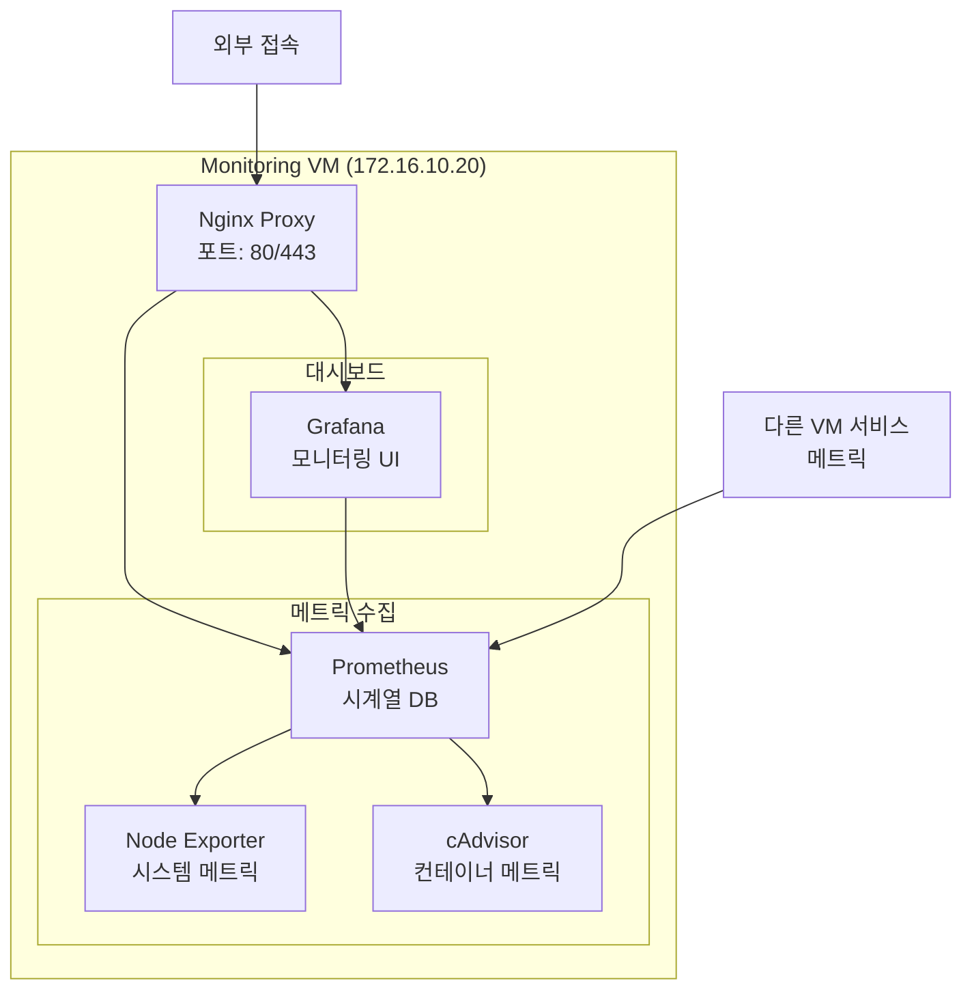

# Monitoring VM 설정 가이드

## 소스코드 가져오기
Monitoring 환경만 선택적으로 클론하기:
```bash
# 1. 빈 저장소 초기화
git init docker-compose
cd docker-compose
git remote add origin https://github.com/cnf-kunkin/docker-compose.git

# 2. Monitoring 디렉토리만 가져오기
git sparse-checkout init
git sparse-checkout set monitoring
git pull origin main

# 3. Monitoring 디렉토리로 이동
cd monitoring
```

## 설정 파일 생성
```bash
# 환경변수 파일 생성
cp config/env.sample .env

# 환경변수 파일 수정
cat > .env << EOF
# Grafana 설정
GF_SECURITY_ADMIN_PASSWORD=change_this_password  # 변경 필요
GF_SERVER_ROOT_URL=https://grafana.local

# Prometheus 설정
PROMETHEUS_RETENTION_TIME=15d
PROMETHEUS_STORAGE_PATH=/data/prometheus
EOF

# 권한 설정
chmod 600 .env
```

## 1. 시스템 구성도


## 2. 보안 강화 설정

### 2.1 Prometheus 보안 설정
```yaml
# config/prometheus/prometheus.yml에 추가
global:
  scrape_timeout: 15s
  evaluation_interval: 15s

# 기본 인증 설정
basic_auth_users:
  admin: <hashed_password>

# HTTPS 설정
tls_server_config:
  cert_file: /etc/prometheus/certs/prometheus.crt
  key_file: /etc/prometheus/certs/prometheus.key
```

### 2.2 Grafana 보안 설정
```ini
# config/grafana/grafana.ini에 추가
[security]
admin_user = admin
disable_gravatar = true
cookie_secure = true
strict_transport_security = true
content_security_policy = true

[auth]
disable_login_form = false
oauth_auto_login = false
disable_signout_menu = false

[session]
session_life_time = 24h
cookie_secure = true
```

### 2.3 Nginx 보안 헤더
```nginx
# config/nginx/nginx.conf에 추가
add_header X-Frame-Options "DENY" always;
add_header X-Content-Type-Options "nosniff" always;
add_header X-XSS-Protection "1; mode=block" always;
add_header Content-Security-Policy "default-src 'self';" always;
```

## 3. 모니터링 대시보드 설정

### 3.1 시스템 모니터링
- CPU, 메모리, 디스크 사용량
- 네트워크 트래픽
- 시스템 로드

### 3.2 컨테이너 모니터링
- 컨테이너 상태
- 리소스 사용량
- 로그 집계

### 3.3 서비스 모니터링
- 응답 시간
- 오류율
- 요청량

## 4. 알림 설정
```yaml
# Alertmanager 설정
alerting:
  alertmanagers:
    - static_configs:
        - targets:
          - alertmanager:9093

# 알림 규칙
rules:
  - alert: HighCPUUsage
    expr: cpu_usage_percent > 80
    for: 5m
    labels:
      severity: warning
    annotations:
      summary: High CPU usage detected
```

## 5. 백업 절차
```bash
# Prometheus 데이터 백업
tar -czf prometheus_data_$(date +%Y%m%d).tar.gz /data/prometheus

# Grafana 설정 백업
tar -czf grafana_$(date +%Y%m%d).tar.gz /data/grafana
```

## 6. 보안 체크리스트
- [ ] 모든 서비스에 HTTPS 적용됨
- [ ] 기본 인증 설정됨
- [ ] 강력한 비밀번호 정책 적용됨
- [ ] 불필요한 포트 차단됨
- [ ] 메트릭 수집 대상 제한됨
- [ ] 로그 순환 설정됨
- [ ] 알림 설정 검증됨

## 7. 사전 준비사항
- Ubuntu 24.04 설치 완료
- Docker 및 Docker Compose 설치 완료
- 도메인: grafana.local, prometheus.local (172.16.10.20)

## 8. 디렉토리 구조 생성
```bash
mkdir -p config/{nginx,grafana,prometheus}
mkdir -p data/{grafana,prometheus}
```

## 9. 서비스 실행
```bash
cd docker
docker compose up -d
```

## 10. 초기 설정
### 10.1 Grafana 접속
- URL: https://grafana.local
- 기본 계정: admin/admin
- 최초 접속 시 비밀번호 변경 필요

### 10.2 Prometheus 데이터 소스 추가
1. Grafana 설정 > Data Sources
2. Add data source > Prometheus
3. URL: http://prometheus:9090
4. Save & Test
