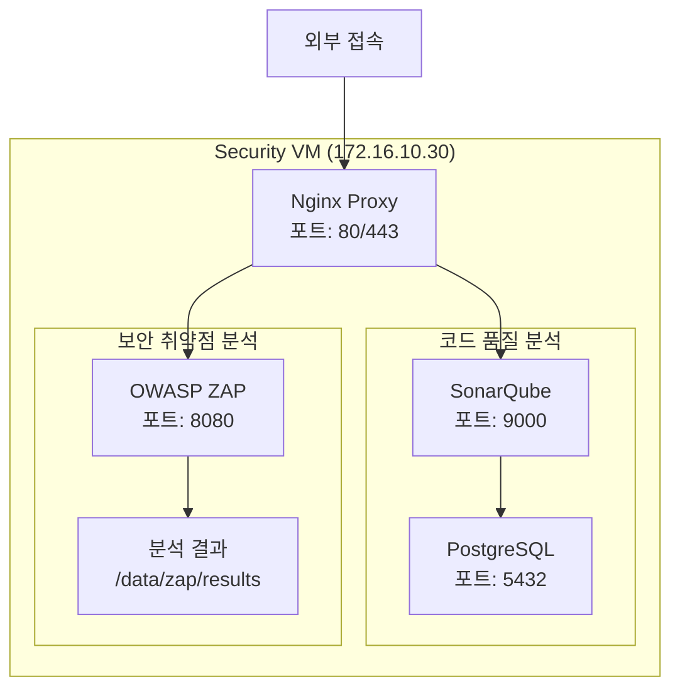

# Security VM 설정 가이드

## 소스코드 가져오기
Security 환경만 선택적으로 클론하기:
```bash
# 1. 빈 저장소 초기화
git init docker-compose
cd docker-compose
git remote add origin https://github.com/cnf-kunkin/docker-compose.git

# 2. Security 디렉토리만 가져오기
git sparse-checkout init
git sparse-checkout set security
git pull origin main

# 3. Security 디렉토리로 이동
cd security
```

## 1. 시스템 구성도


## 2. 사전 준비사항
- Ubuntu 24.04 설치 완료
- Docker 및 Docker Compose 설치 완료
- 도메인: sonarqube.local, security.local (172.16.10.30)

## 3. 디렉토리 구조 생성
```bash
mkdir -p config/{nginx,sonarqube,zap}
mkdir -p data/{sonarqube,zap}
```

## 설정 파일 생성
```bash
# 환경변수 파일 생성
cp config/env.sample .env

# 환경변수 파일 수정
cat > .env << EOF
# SonarQube 설정
SONAR_JDBC_USERNAME=sonar
SONAR_JDBC_PASSWORD=change_this_password     # 변경 필요
SONAR_JDBC_URL=jdbc:postgresql://sonarqube-db:5432/sonar
SONAR_ES_JAVA_OPTS=-Xmx512m -Xms512m

# OWASP ZAP 설정
ZAP_API_KEY=change_this_api_key             # 변경 필요
EOF

# 권한 설정
chmod 600 .env
```

## 4. 서비스 실행
```bash
cd docker
docker compose up -d
```

## 5. 초기 설정
### 5.1 SonarQube 접속
- URL: https://sonarqube.local
- 기본 계정: admin/admin
- 최초 접속 시 비밀번호 변경 필요

### 5.2 OWASP ZAP 설정
- URL: https://security.local
- API Key 설정: config/zap/api-key.conf 파일 참조

## 6. 보안 설정

### 6.1 SonarQube 보안 강화
```bash
# PostgreSQL 데이터베이스 보안 설정
sudo chown -R 999:999 /data/sonarqube/postgresql
sudo chmod 700 /data/sonarqube/postgresql

# SonarQube 설정 파일 보안
sudo chmod 600 config/sonarqube/sonar.properties

# 메모리 설정
sudo sysctl -w vm.max_map_count=262144
sudo sysctl -w fs.file-max=65536
```

### 6.2 OWASP ZAP 보안 설정
```bash
# API 키 설정
echo "api.key=$(openssl rand -hex 32)" > config/zap/api-key.conf
sudo chmod 600 config/zap/api-key.conf

# 스캔 결과 디렉토리 권한
sudo chown -R 1000:1000 /data/zap
sudo chmod 700 /data/zap
```

## 7. 모니터링 및 로깅

### 7.1 로그 모니터링
```bash
# SonarQube 로그
tail -f /data/sonarqube/logs/sonar.log

# ZAP 로그
tail -f /data/zap/zap.log

# Nginx 로그
tail -f /data/logs/nginx/error.log
```

### 7.2 성능 모니터링
```bash
# 리소스 사용량
docker stats

# 데이터베이스 상태
docker compose exec sonarqube-db psql -U sonar -c "SELECT count(*) FROM pg_stat_activity;"
```

## 8. 백업 절차

### 8.1 데이터 백업
```bash
# SonarQube 데이터 백업
tar -czf sonarqube_data_$(date +%Y%m%d).tar.gz /data/sonarqube

# ZAP 설정 및 결과 백업
tar -czf zap_data_$(date +%Y%m%d).tar.gz /data/zap
```

### 8.2 데이터베이스 백업
```bash
# PostgreSQL 백업
docker compose exec sonarqube-db pg_dump -U sonar sonar > sonar_db_$(date +%Y%m%d).sql
```

## 9. 문제 해결

### 9.1 일반적인 문제
1. SonarQube 시작 실패
   - 로그 확인: `cat /data/sonarqube/logs/sonar.log`
   - 메모리 설정 확인: `sysctl -a | grep vm.max_map_count`
   - 데이터베이스 연결 확인

2. OWASP ZAP 연결 오류
   - API 키 확인
   - 네트워크 연결 확인
   - 권한 설정 확인

## 10. 보안 체크리스트
- [ ] 모든 기본 비밀번호 변경
- [ ] API 키 안전하게 보관
- [ ] 불필요한 포트 차단
- [ ] 파일 권한 적절히 설정
- [ ] SSL/TLS 설정 검증
- [ ] 정기적인 보안 업데이트
- [ ] 백업 절차 검증
