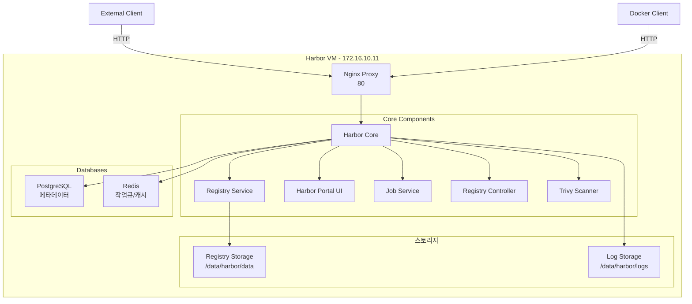

# Harbor VM 설치 가이드

## 1. 환경 구성
- IP: 172.16.10.11
- Hostname: vm-harbor
- 서비스: Harbor Registry
- 포트: 80 (HTTP)

## 1. 시스템 구성도



### 1.1 컴포넌트 설명

#### 핵심 서비스
- **Harbor Core**: API 서비스 및 웹훅 처리
- **Registry**: Docker/OCI 이미지 저장소
- **Portal**: 웹 UI 인터페이스
- **Job Service**: 복제/스캔 작업 관리
- **Registry Controller**: 레지스트리 관리
- **Trivy**: 컨테이너 취약점 스캐너

#### 데이터베이스
- **PostgreSQL**
  - 용도: 사용자/프로젝트/정책 메타데이터
  - 경로: /data/database
  - 계정: postgres/root123

- **Redis**
  - 용도: 세션관리, 작업큐
  - 경로: /data/redis
  - 인증: 비활성화

#### 저장소
- **Registry Storage**: /data/registry
  - 컨테이너 이미지
  - 아티팩트 메타데이터

- **Log Storage**: /var/log/harbor
  - 시스템/접근 로그
  - 작업 로그

### 1.2 네트워크 구성
- **외부 접근**
  - HTTP: 80 포트
  - IP 기반 접근: http://172.16.10.11:80

- **내부 네트워크**
  - harbor_network (Docker bridge)
  - 컨테이너 간 통신

### 1.3 볼륨 구성
```plaintext
/data/
├── harbor/          # Harbor 설정 및 데이터
├── database/        # PostgreSQL 데이터
├── redis/           # Redis 데이터
└── registry/        # 이미지 저장소
```

## 2. 설치 순서

### 2.1 기본 환경 설정
```bash
# 디렉토리 생성
sudo mkdir -p /data/harbor/data
sudo mkdir -p /data/harbor/logs
sudo mkdir -p /data/docker-compose

sudo chmod -R 777 /data
```

### 2.2 Harbor 설치 준비
```bash
# Harbor 설치 파일 다운로드
# https://github.com/goharbor/harbor/releases 최신 버전 확인 
cd /data/docker-compose
sudo wget https://github.com/goharbor/harbor/releases/download/v2.12.2/harbor-offline-installer-v2.12.2.tgz

sudo tar xzvf harbor-offline-installer-v2.12.2.tgz
```

## 3. 서비스 배포

### 3.1 설정 파일 준비
```bash
# Harbor 설정
cd /data/docker-compose/harbor
sudo cp harbor.yml.tmpl harbor.yml

# 설정 파일 수정
sudo vi harbor.yml
```
hostname: 172.16.10.11

#https:
  #certificate: /your/certificate/path
  #private_key: /your/private/key/path

data_volume: /data/harbor/data

```


### 3.2 Harbor 설치
```bash
# 설치 전 Docker Compose 플러그인 확인
docker compose version

# 설치 스크립트 실행 
sudo ./install.sh 

# 컨테이너 상태 확인
sudo docker compose ps
sudo docker compose logs
```

## 4. 서비스 접속 정보
- URL: http://172.16.10.11:80
- 초기 계정: admin
- 초기 비밀번호: Harbor12345
