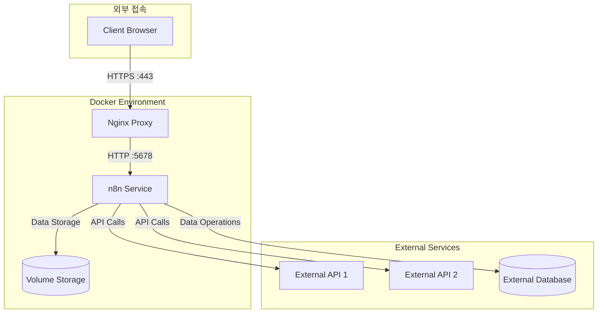

# Docker Compose 설치 가이드

## 1. 사전 요구사항
- Ubuntu 20.04 LTS 이상
- sudo 권한
- 인터넷 연결

## 2. Docker 설치
```bash
# 시스템 패키지 업데이트
sudo apt update
sudo apt upgrade -y

# Docker 설치에 필요한 패키지 설치
sudo apt install -y apt-transport-https ca-certificates curl software-properties-common

# Docker 공식 GPG 키 추가
curl -fsSL https://download.docker.com/linux/ubuntu/gpg | sudo gpg --dearmor -o /usr/share/keyrings/docker-archive-keyring.gpg

# Docker 레포지토리 추가
echo "deb [arch=amd64 signed-by=/usr/share/keyrings/docker-archive-keyring.gpg] https://download.docker.com/linux/ubuntu $(lsb_release -cs) stable" | sudo tee /etc/apt/sources.list.d/docker.list

# Docker 설치
sudo apt update
sudo apt install -y docker-ce docker-ce-cli containerd.io

# Docker 서비스 시작 및 자동 실행 설정
sudo systemctl start docker
sudo systemctl enable docker

# 현재 사용자를 docker 그룹에 추가
sudo usermod -aG docker $USER
```

## 3. Docker Compose 설치
```bash
# Docker Compose 최신 버전 다운로드
COMPOSE_VERSION=$(curl -s https://api.github.com/repos/docker/compose/releases/latest | grep 'tag_name' | cut -d '"' -f 4)
sudo curl -L "https://github.com/docker/compose/releases/download/${COMPOSE_VERSION}/docker-compose-$(uname -s)-$(uname -m)" -o /usr/local/bin/docker-compose

# 실행 권한 부여
sudo chmod +x /usr/local/bin/docker-compose
```

## 4. 설치 확인
```bash
# Docker 버전 확인
docker --version

# Docker Compose 버전 확인
docker-compose --version
```

## 5. 주의사항
- 설치 후 시스템 재로그인이 필요할 수 있습니다.
- Docker 데몬이 정상적으로 실행 중인지 확인하세요.
- 방화벽 설정이 필요한 경우 Docker 관련 포트를 허용해야 합니다.

## 6. n8n 설치 및 실행
### 6.1 디렉토리 구조 생성
```bash
# 필요한 디렉토리 생성
sudo mkdir -p /data/n8n_data
sudo mkdir -p /data/nginx/{conf,ssl,logs}
sudo chmod -R 777 /data
```

### 6.2 SSL 인증서 생성
```bash
# SSL 인증서 생성
openssl req -x509 -nodes -days 3650 -newkey rsa:2048 \
  -keyout /data/nginx/ssl/n8n.local.key \
  -out /data/nginx/ssl/n8n.local.crt

ll /data/nginx/ssl/
```

### 6.3 호스트 설정
```bash
# 호스트 파일에 도메인 추가
echo "172.16.10.12 n8n.local" | sudo tee -a /etc/hosts
```


### docker-compose.yml 파일 작성
```bash
mkdir ~/docker-services
cd ~/docker-services

cat > docker-compose.yml << 'EOL'
version: '3.8'

services:
  n8n:
    image: n8nio/n8n
    restart: always
    ports:
      - "5678:5678"
    environment:
      - N8N_HOST=n8n.local
      - N8N_PORT=5678
      - NODE_ENV=production
    volumes:
      - /data/n8n_data:/home/node/.n8n
    networks:
      - n8n_network

  nginx:
    image: nginx:latest
    restart: always
    ports:
      - "80:80"
      - "443:443"
    volumes:
      - /data/nginx/conf:/etc/nginx/conf.d
      - /data/nginx/ssl:/etc/nginx/ssl
      - /data/nginx/logs:/var/log/nginx
    depends_on:
      - n8n
    networks:
      - n8n_network

networks:
  n8n_network:
    driver: bridge
EOL
```

### Nginx 설정 파일 작성
```bash
mkdir -p /data/nginx/conf
cat > /data/nginx/conf/default.conf << 'EOL'
# n8n reverse proxy configuration
server {
    listen 443 ssl;
    server_name n8n.local;

    ssl_certificate /etc/nginx/ssl/n8n.local.crt;
    ssl_certificate_key /etc/nginx/ssl/n8n.local.key;
    ssl_protocols TLSv1.2 TLSv1.3;
    ssl_ciphers HIGH:!aNULL:!MD5;

    location / {
        proxy_pass http://n8n:5678;
        proxy_set_header Host $host;
        proxy_set_header X-Real-IP $remote_addr;
        proxy_set_header X-Forwarded-For $proxy_add_x_forwarded_for;
        proxy_set_header X-Forwarded-Proto $scheme;
        proxy_redirect http:// https://;
        proxy_http_version 1.1;
        proxy_set_header Upgrade $http_upgrade;
        proxy_set_header Connection "upgrade";
    }

    access_log /var/log/nginx/n8n_access.log;
    error_log /var/log/nginx/n8n_error.log;
}

# HTTP to HTTPS redirect
server {
    listen 80;
    server_name n8n.local;
    return 301 https://$host$request_uri;
}

EOL
```

## 서비스 실행

### Docker Compose 서비스 시작
```bash
cd ~/docker-services
docker-compose up -d
```


### 6.4 서비스 실행
```bash
# Docker Compose로 서비스 시작
docker-compose up -d

# 로그 확인
docker-compose logs -f
```

### 6.5 접속 확인
- 웹 브라우저에서 https://n8n.local 접속
- 초기 설정 완료 후 워크플로우 생성 가능

## 7. n8n 아키텍처


### 주요 구성 요소
1. **Nginx Reverse Proxy**
   - SSL/TLS 종단점
   - HTTPS 트래픽 처리
   - 도메인 기반 라우팅

2. **n8n Service**
   - 워크플로우 엔진
   - API 통합
   - 자동화 실행

3. **Volume Storage**
   - 워크플로우 데이터
   - 크리덴셜
   - 설정 파일

### 보안 고려사항
- SSL/TLS 인증서 관리
- API 키와 시크릿 보안
- 네트워크 접근 제어
