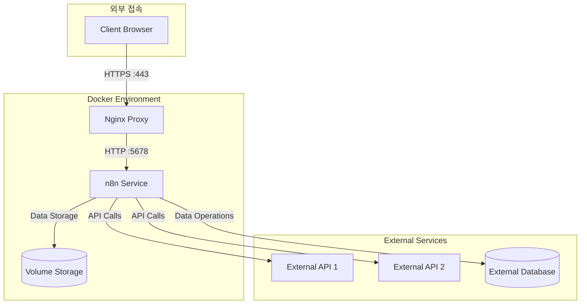

## 6. n8n 설치 및 실행
### 6.1 디렉토리 구조 생성
```bash
# 필요한 디렉토리 생성
sudo mkdir -p /data/n8n/data
sudo mkdir -p /data/n8n/log
sudo mkdir /data/docker-compose
sudo chmod -R 777 /data
```


### docker-compose.yml 파일 작성
```bash

cd /data/docker-compose

# sudo vi docker-compose.yml
```
version: '3.8'

services:
  n8n:
    image: n8nio/n8n:latest
    container_name: n8n
    restart: unless-stopped
    environment:
      - N8N_HOST=172.16.10.12
      - N8N_PORT=5678
      - N8N_PROTOCOL=http
      - N8N_SECURE_COOKIE=false
      - NODE_ENV=production
      - N8N_EDITOR_BASE_URL=http://172.16.10.12:5678
      - WEBHOOK_URL=http://172.16.10.12:5678/
      - TZ=Asia/Seoul
    ports:
      - "5678:5678"
    volumes:
      - /data/n8n/data:/home/node/.n8n
      - /data/n8n/files:/files


```
## 서비스 실행

### Docker Compose 서비스 시작
```bash
cd /data/docker-compose
sudo docker compose up -d
```


### 6.4 서비스 실행
```bash
# Docker Compose로 서비스 시작
docker-compose up -d

# 로그 확인
docker-compose logs -f
```

### 6.5 접속 확인
- 웹 브라우저에서 http://172.16.10.12 접속
- 초기 비밀번호 설정 및 메일로 인증 후 사용 
- 초기 설정 완료 후 워크플로우 생성 가능

## 7. n8n 아키텍처

