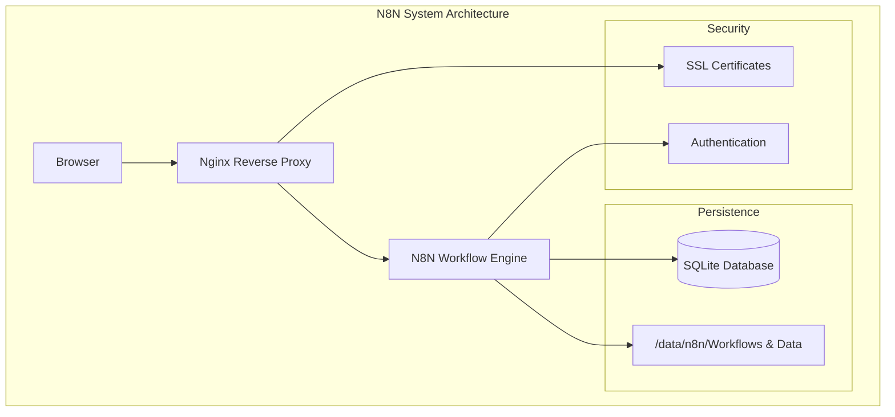

# N8N Workflow Engine 설치 가이드

## 1. N8N 아키텍처


## 2. 시스템 요구사항
- Ubuntu 22.04 LTS
- Docker Engine
- Docker Compose
- 2 CPU Cores
- 4GB RAM
- 50GB Storage

## 3. 설치 단계

### 3.1. 설정 파일 생성

```bash
# 작업 디렉토리 생성
sudo mkdir -p /data/nginx/certs
sudo mkdir -p /data/n8n/{db,files}
sudo chmod -R 777 /data

# Docker Compose 설정
mkdir -p ~/docker-compose
cd ~/docker-compose

cat > docker-compose.yml << 'EOL'
version: '3.8'

services:
  n8n:
    image: n8nio/n8n:latest
    container_name: n8n
    restart: always
    ports:
      - "5678:5678"
    environment:
      - N8N_HOST=n8n.local
      - N8N_PORT=5678
      - N8N_PROTOCOL=https
      - N8N_SSL_CERT=/data/certs/n8n.local.crt
      - N8N_SSL_KEY=/data/certs/n8n.local.key
      - N8N_BASIC_AUTH_ACTIVE=true
      - N8N_BASIC_AUTH_USER=admin
      - N8N_BASIC_AUTH_PASSWORD=changeme
      - DB_TYPE=sqlite
      - DB_SQLITE_PATH=/data/db/n8n.db
    volumes:
      - /data/n8n/db:/data/db
      - /data/n8n/files:/data/files
      - /data/nginx/certs:/data/certs
    networks:
      - n8n-network

  nginx:
    image: nginx:alpine
    container_name: n8n-nginx
    restart: always
    ports:
      - "80:80"
      - "443:443"
    volumes:
      - /data/nginx/nginx/nginx.conf:/etc/nginx/nginx.conf:ro
      - /data/nginx/nginx/conf.d:/etc/nginx/conf.d:ro
      - /data/nginx/certs:/etc/nginx/certs:ro
    depends_on:
      - n8n
    networks:
      - n8n-network

networks:
  n8n-network:
    name: n8n-network
    driver: bridge
EOL

# Nginx 메인 설정
cat > docker/nginx/nginx.conf << 'EOL'
user  nginx;
worker_processes  auto;

error_log  /var/log/nginx/error.log notice;
pid        /var/run/nginx.pid;

events {
    worker_connections  1024;
}

http {
    include       /etc/nginx/mime.types;
    default_type  application/octet-stream;

    log_format  main  '$remote_addr - $remote_user [$time_local] "$request" '
                      '$status $body_bytes_sent "$http_referer" '
                      '"$http_user_agent" "$http_x_forwarded_for"';

    access_log  /var/log/nginx/access.log  main;

    sendfile        on;
    keepalive_timeout  65;

    include /etc/nginx/conf.d/*.conf;
}
EOL

# Nginx 사이트 설정
cat > docker/nginx/conf.d/default.conf << 'EOL'
server {
    listen 443 ssl;
    server_name n8n.local;

    ssl_certificate /etc/nginx/certs/n8n.local.crt;
    ssl_certificate_key /etc/nginx/certs/n8n.local.key;

    # SSL configuration
    ssl_protocols TLSv1.2 TLSv1.3;
    ssl_prefer_server_ciphers on;
    ssl_ciphers ECDHE-ECDSA-AES128-GCM-SHA256:ECDHE-RSA-AES128-GCM-SHA256:ECDHE-ECDSA-AES256-GCM-SHA384:ECDHE-RSA-AES256-GCM-SHA384:ECDHE-ECDSA-CHACHA20-POLY1305:ECDHE-RSA-CHACHA20-POLY1305:DHE-RSA-AES128-GCM-SHA256:DHE-RSA-AES256-GCM-SHA384;

    # Proxy settings
    location / {
        proxy_pass http://n8n:5678;
        proxy_set_header Host $host;
        proxy_set_header X-Real-IP $remote_addr;
        proxy_set_header X-Forwarded-For $proxy_add_x_forwarded_for;
        proxy_set_header X-Forwarded-Proto $scheme;

        # WebSocket support
        proxy_http_version 1.1;
        proxy_set_header Upgrade $http_upgrade;
        proxy_set_header Connection "upgrade";
    }

    # Security headers
    add_header X-Frame-Options "SAMEORIGIN" always;
    add_header X-XSS-Protection "1; mode=block" always;
    add_header X-Content-Type-Options "nosniff" always;
    add_header Referrer-Policy "no-referrer-when-downgrade" always;
}

server {
    listen 80;
    server_name n8n.local;
    return 301 https://$server_name$request_uri;
}
EOL

# 인증서 생성 스크립트
cat > docker/generate-certs.sh << 'EOL'
#!/bin/bash

# Create directories if they don't exist
sudo mkdir -p /data/nginx/certs
sudo mkdir -p /data/n8n/{db,files}

# Generate SSL certificate
cd /data/nginx/certs
sudo openssl req -x509 -nodes -days 365 -newkey rsa:2048 \
    -keyout n8n.local.key -out n8n.local.crt \
    -subj "/C=KR/ST=Seoul/L=Seoul/O=Local/CN=n8n.local"

# Set proper permissions
sudo chmod 644 /data/nginx/certs/n8n.local.crt
sudo chmod 600 /data/nginx/certs/n8n.local.key
sudo chown -R root:root /data/nginx/certs

# Create data directories with proper permissions
sudo chown -R 1000:1000 /data/n8n
sudo chmod -R 755 /data/n8n

echo "Certificate generation complete!"
echo "Please add the following line to your hosts file:"
echo "172.16.10.12 n8n.local"
EOL

# 스크립트 실행 권한 부여
chmod +x docker/generate-certs.sh
```

### 3.2. VM 생성 및 OS 설치
1. VMware에서 새로운 VM 생성
   - Name: vm-n8n
   - OS: Ubuntu 22.04 LTS
   - CPU: 2 cores
   - RAM: 4GB
   - Storage: 50GB
   - Network: Custom (NAT)

2. 네트워크 설정
   ```bash
   sudo vi /etc/netplan/50-installer-config.yaml
   ```
   ```yaml
   network:
     ethernets:
       ens33:
         dhcp4: no
         addresses:
           - 172.16.10.12/24
         gateway4: 172.16.10.2
         nameservers:
           addresses: [8.8.8.8, 8.8.4.4]
     version: 2
   ```

### 3.3. 디렉토리 구조 생성
```bash
sudo mkdir -p /data/n8n/{db,files}
sudo mkdir -p /data/nginx/{conf,certs}
```

### 3.4. SSL 인증서 생성
```bash
cd /data/nginx/certs
sudo openssl req -x509 -nodes -days 365 -newkey rsa:2048 \
    -keyout n8n.local.key -out n8n.local.crt \
    -subj "/C=KR/ST=Seoul/L=Seoul/O=Local/CN=n8n.local"
```

### 3.5. Nginx 설정
```nginx
server {
    listen 443 ssl;
    server_name n8n.local;

    ssl_certificate /etc/nginx/certs/n8n.local.crt;
    ssl_certificate_key /etc/nginx/certs/n8n.local.key;

    location / {
        proxy_pass http://n8n:5678;
        proxy_set_header Host $host;
        proxy_set_header X-Real-IP $remote_addr;
        proxy_set_header X-Forwarded-For $proxy_add_x_forwarded_for;
        proxy_set_header X-Forwarded-Proto $scheme;
    }
}

server {
    listen 80;
    server_name n8n.local;
    return 301 https://$server_name$request_uri;
}
```

### 3.6. Docker Compose 설정
```yaml
version: '3.8'

services:
  n8n:
    image: n8nio/n8n:latest
    container_name: n8n
    restart: always
    ports:
      - "5678:5678"
    environment:
      - N8N_HOST=n8n.local
      - N8N_PORT=5678
      - N8N_PROTOCOL=https
      - N8N_SSL_CERT=/data/certs/n8n.local.crt
      - N8N_SSL_KEY=/data/certs/n8n.local.key
      - N8N_BASIC_AUTH_ACTIVE=true
      - N8N_BASIC_AUTH_USER=admin
      - N8N_BASIC_AUTH_PASSWORD=changeme
      - DB_TYPE=sqlite
      - DB_SQLITE_PATH=/data/db/n8n.db
    volumes:
      - /data/n8n/db:/data/db
      - /data/n8n/files:/data/files
      - /data/nginx/certs:/data/certs
    networks:
      - n8n-network

  nginx:
    image: nginx:alpine
    container_name: n8n-nginx
    restart: always
    ports:
      - "80:80"
      - "443:443"
    volumes:
      - /data/nginx/conf/nginx.conf:/etc/nginx/nginx.conf:ro
      - /data/nginx/conf.d:/etc/nginx/conf.d:ro
      - /data/nginx/certs:/etc/nginx/certs:ro
    depends_on:
      - n8n
    networks:
      - n8n-network

networks:
  n8n-network:
    name: n8n-network
    driver: bridge

volumes:
  n8n-data:
    driver: local
    driver_opts:
      type: none
      o: bind
      device: /data/n8n
```

## 4. 설치 및 실행

1. Docker 설치
```bash
sudo apt update
sudo apt install -y docker.io docker-compose
sudo usermod -aG docker $USER
```

2. 서비스 시작
```bash
docker-compose up -d
```

3. 로그 확인
```bash
docker-compose logs -f
```

## 5. 접속 방법
1. hosts 파일에 도메인 추가 (Windows)
```
172.16.10.12 n8n.local
```

2. 브라우저에서 접속
```
https://n8n.local
```

초기 로그인 정보:
- Username: admin
- Password: changeme

## 6. 주의사항
1. 보안
   - 초기 비밀번호 변경 필수
   - 방화벽 설정 확인
   - 정기적인 백업 설정

2. 유지보수
   - 로그 모니터링
   - 디스크 공간 모니터링
   - 정기적인 업데이트 수행

## 7. 문제해결
1. 접속 불가 시
   - nginx 서비스 상태 확인
   - SSL 인증서 확인
   - 방화벽 설정 확인

2. 데이터 저장 문제
   - 볼륨 마운트 확인
   - 권한 설정 확인