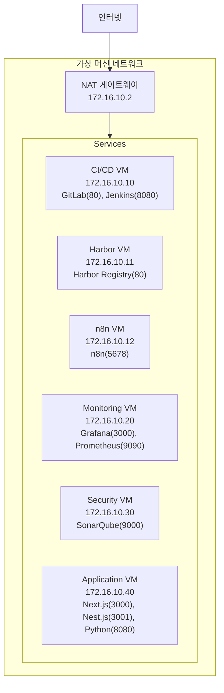
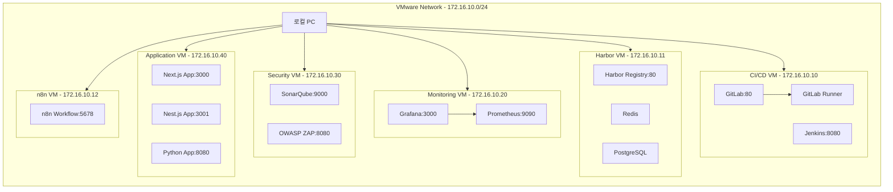

# MSA 개발 환경 시스템 구성도

## 1. 시스템 개요
개인 개발자 PC에 VMware를 이용하여 MSA 개발/운영 환경을 구축합니다.
모든 서비스는 HTTP를 통해 IP 주소와 포트로 직접 접근합니다.

## 2. 주요 기능
1. CI/CD 환경
   - 소스 코드 관리 (GitLab)
   - 자동화 파이프라인 (Jenkins)
   - 컨테이너 레지스트리 (Harbor)

2. 모니터링 환경
   - 시스템 메트릭 수집 (Prometheus)
   - 대시보드 시각화 (Grafana)

3. 보안 및 품질 관리
   - 코드 품질 분석 (SonarQube)
   - 보안 취약점 검사 (OWASP ZAP)

4. 애플리케이션 환경
   - 프론트엔드 (Next.js)
   - 백엔드 API (Nest.js)
   - 데이터 처리 (Python)

5. 워크플로우 자동화
   - 업무 프로세스 자동화 (n8n)
   - API 통합 및 연동
   - 스케줄링 및 이벤트 기반 실행

## 3. 네트워크 구성

## VM 구성
1. CI/CD VM (6CPU, 12GB RAM)
   - GitLab (포트: 80)
   - GitLab Runner
   - Jenkins (포트: 8080)

2. Harbor VM (4CPU, 8GB RAM)
   - Harbor Registry (포트: 80)
   - Redis
   - PostgreSQL

3. n8n VM (2CPU, 4GB RAM)
   - n8n Workflow (포트: 5678)

4. Monitoring VM (2CPU, 4GB RAM)
   - Grafana (포트: 3000)
   - Prometheus (포트: 9090)

5. Security VM (2CPU, 4GB RAM)
   - SonarQube (포트: 9000)
   - OWASP ZAP (포트: 8080)

6. Application VM (4CPU, 8GB RAM)
   - Next.js App (포트: 3000)
   - Nest.js App (포트: 3001)
   - Python App (포트: 8080)

## 시스템 구성도

## VM 네트워크 구성
- VMware Network: 172.16.10.0/24
- CI/CD VM: 172.16.10.10 (GitLab:80, Jenkins:8080)
- Harbor VM: 172.16.10.11 (Harbor:80)
- n8n VM: 172.16.10.12 (n8n:5678)
- Monitoring VM: 172.16.10.20 (Grafana:3000, Prometheus:9090)
- Security VM: 172.16.10.30 (SonarQube:9000, ZAP:8080)
- Application VM: 172.16.10.40 (Next:3000, Nest:3001, Python:8080)

## VMware 네트워크 설정
- 네트워크 타입: NAT
- DHCP: 사용하지 않음 (고정 IP 사용)
- 서브넷: 172.16.10.0/24
- NAT 게이트웨이: 172.16.10.2

## 서비스 접근 정보
| 서비스 | 접속 주소 | 설명 |
|--------|-----------|------|
| GitLab | http://172.16.10.10:80 | 소스코드 관리 |
| Jenkins | http://172.16.10.10:8080 | CI/CD 파이프라인 |
| Harbor | http://172.16.10.11:80 | 컨테이너 레지스트리 |
| Grafana | http://172.16.10.20:3000 | 모니터링 대시보드 |
| Prometheus | http://172.16.10.20:9090 | 메트릭 수집/조회 |
| SonarQube | http://172.16.10.30:9000 | 코드 품질 분석 |
| OWASP ZAP | http://172.16.10.30:8080 | 보안 취약점 분석 |
| Next.js Demo | http://172.16.10.40:3000 | 프론트엔드 데모 |
| Nest.js Demo | http://172.16.10.40:3001 | 백엔드 API 데모 |
| Python Demo | http://172.16.10.40:8080 | Python API 데모 |
| n8n Workflow | http://172.16.10.12:5678 | 워크플로우 자동화 |

## 필요한 도구
- VMware Workstation/Player
- Docker Desktop

## VM 설치 요구사항
- 호스트 PC 요구사항:
  - CPU: 최소 16코어 (권장 20코어)
  - 메모리: 최소 32GB (권장 64GB)
  - 디스크: 최소 500GB
  - OS: Windows 10/11 Pro 이상
- VMware Workstation Pro 17 이상

## 5. 보안 설계
1. 네트워크 보안
   - VM 간 격리된 네트워크
   - 내부 서비스 직접 접근 제어

2. 접근 제어
   - IP 기반 접근 제어
   - 포트 기반 서비스 분리

3. 모니터링
   - 실시간 시스템 모니터링
   - 로그 중앙화
   - 보안 이벤트 추적