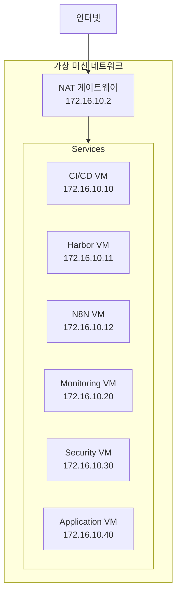

# MSA 개발 환경 시스템 구성도

## 1. 시스템 개요
개인 개발자 PC에 VMware를 이용하여 MSA 개발/운영 환경을 구축합니다.
모든 서비스는 HTTPS를 통해 접근 가능하며, 도메인 기반(.local)으로 운영됩니다.

## 2. 주요 기능
1. CI/CD 환경
   - 소스 코드 관리 (GitLab)
   - 자동화 파이프라인 (Jenkins)
   - 컨테이너 레지스트리 (Harbor)

2. 모니터링 환경
   - 시스템 메트릭 수집 (Prometheus)
   - 대시보드 시각화 (Grafana)

3. 보안 및 품질 관리
   - 코드 품질 분석 (SonarQube)
   - 보안 취약점 검사 (OWASP ZAP)

4. 애플리케이션 환경
   - 프론트엔드 (Next.js)
   - 백엔드 API (Nest.js)
   - 데이터 처리 (Python)

## 3. 네트워크 구성


## VM 구성
1. CI/CD VM (6CPU, 12GB RAM)
   - GitLab
   - GitLab Runner
   - Jenkins
   - Nginx Proxy

2. Monitoring VM (2CPU, 4GB RAM)
   - Grafana
   - Prometheus
   - Nginx Proxy

3. Security VM (2CPU, 4GB RAM)
   - SonarQube
   - OWASP ZAP
   - Nginx Proxy

4. Application VM (4CPU, 8GB RAM)
   - Next.js App
   - Nest.js App
   - Python App
   - Nginx Proxy

5. N8N VM (2CPU, 4GB RAM)
   - N8N Workflow Engine
   - Nginx Proxy
   - SQLite Database

## 시스템 구성도
```mermaid
graph TD
    Client[로컬 PC] --> VMware[VMware Workstation]
    
    subgraph VMware[VMware Network - 172.16.10.0/24]
        subgraph CICD_VM[CI/CD VM - 172.16.10.10]
            CICD_Nginx[Nginx Proxy] --> GitLab
            CICD_Nginx --> Jenkins
            GitLab --> Runner[GitLab Runner]
        end
        
        subgraph MON_VM[Monitoring VM - 172.16.10.20]
            MON_Nginx[Nginx Proxy] --> Grafana
            MON_Nginx --> Prometheus
            Grafana --> Prometheus
        end
        
        subgraph SEC_VM[Security VM - 172.16.10.30]
            SEC_Nginx[Nginx Proxy] --> SonarQube
            SEC_Nginx --> OWASPZAP[OWASP ZAP]
        end
        
        subgraph APP_VM[Application VM - 172.16.10.40]
            APP_Nginx[Nginx Proxy] --> NextApp[Next.js App]
            APP_Nginx --> NestApp[Nest.js App]
            APP_Nginx --> PythonApp[Python App]
        end

        subgraph N8N_VM[N8N VM - 172.16.10.12]
            N8N_Nginx[Nginx Proxy] --> N8N[N8N Workflow]
            N8N --> N8N_DB[(SQLite DB)]
            N8N --> N8N_DATA[/data/n8n]
        end

        Client --> CICD_VM
        Client --> MON_VM
        Client --> SEC_VM
        Client --> APP_VM
        Client --> N8N_VM
    end
```

## VM 네트워크 구성
- VMware Network: 172.16.10.0/24
- CI/CD VM: 172.16.10.10
- Harbor VM: 172.16.10.11
- N8N VM: 172.16.10.12
- Monitoring VM: 172.16.10.20
- Security VM: 172.16.10.30
- Application VM: 172.16.10.40

## VMware 네트워크 설정
- 네트워크 타입: NAT
- DHCP: 사용하지 않음 (고정 IP 사용)
- 서브넷: 172.16.10.0/24
- NAT 게이트웨이: 172.16.10.2

## 서비스 도메인 구성
- gitlab.local - GitLab 서버
- jenkins.local - CICD 서버
- grafana.local - 모니터링 대시보드
- sonarqube.local - 코드 품질 검사
- security.local - 보안 검사 도구
- next-demo.local - Next.js 데모
- nest-demo.local - Nest.js 데모
- python-demo.local - Python 데모
- harbor.local - 프라이빗 레지스트리
- n8n.local - 워크플로우 자동화 엔진

## hosts 파일 설정

### 1. 호스트 PC의 hosts 파일 설정
(경로: C:\Windows\System32\drivers\etc\hosts)
```plaintext
# CI/CD 서비스
172.16.10.10   gitlab.local
172.16.10.10   jenkins.local
172.16.10.11   harbor.local

# 모니터링 서비스
172.16.10.20   grafana.local
172.16.10.20   prometheus.local

# 보안 서비스
172.16.10.30   sonarqube.local
172.16.10.30   security.local

# 애플리케이션 서비스
172.16.10.40   next-demo.local
172.16.10.40   nest-demo.local
172.16.10.40   python-demo.local

# 워크플로우 자동화 서비스
172.16.10.12   n8n.local
```

### 2. VM 서버들의 hosts 파일 설정
(경로: /etc/hosts)
```plaintext
# 기본 설정
127.0.0.1   localhost
127.0.1.1   vm-[서버명]

# CI/CD 서비스
172.16.10.10   gitlab.local
172.16.10.10   jenkins.local
172.16.10.11   harbor.local

# 모니터링 서비스
172.16.10.20   grafana.local
172.16.10.20   prometheus.local

# 보안 서비스
172.16.10.30   sonarqube.local
172.16.10.30   security.local

# 애플리케이션 서비스
172.16.10.40   next-demo.local
172.16.10.40   nest-demo.local
172.16.10.40   python-demo.local

# 워크플로우 자동화 서비스
172.16.10.12   n8n.local
```

## 통신 흐름 설명
1. 외부 접근 (호스트 PC -> 서비스)
   - 호스트 PC에서 도메인 접속 시 모든 요청이 각 VM으로 직접 라우팅
   - SSL 인증서는 각 VM에서 관리

2. 내부 통신 (서비스 간 통신)
   - VM 간 직접 통신은 실제 서버 IP를 통해 이루어짐
   - 예: Jenkins에서 GitLab API 호출 시 172.16.10.10 사용
   - 내부 통신은 암호화되지 않은 상태로 가능 (선택사항)

## 트래픽 흐름 설명
1. 사용자는 도메인(예: gitlab.local)으로 접속 요청
2. hosts 파일에 의해 요청이 각 VM으로 직접 전달:
   - gitlab.local -> 172.16.10.10:80 (GitLab)
   - grafana.local -> 172.16.10.20:3000 (Grafana)
   - sonarqube.local -> 172.16.10.30:9000 (SonarQube)
   - n8n.local -> 172.16.10.12:5678 (N8N)
   등...

## 서비스 접근 URL 목록
| 서비스 | URL | 설명 |
|--------|-----|------|
| GitLab | https://gitlab.local | 소스코드 관리 |
| Jenkins | https://jenkins.local | CI/CD 파이프라인 |
| Harbor | https://harbor.local | 컨테이너 레지스트리 |
| N8N | https://n8n.local | 워크플로우 자동화 엔진 |
| Grafana | https://grafana.local | 모니터링 대시보드 |
| Prometheus | https://prometheus.local | 메트릭 수집/조회 |
| SonarQube | https://sonarqube.local | 코드 품질 분석 |
| OWASP ZAP | https://security.local | 보안 취약점 분석 |
| Next.js Demo | https://next-demo.local | 프론트엔드 데모 |
| Nest.js Demo | https://nest-demo.local | 백엔드 API 데모 |
| Python Demo | https://python-demo.local | Python API 데모 |

## 필요한 도구
- VMware Workstation/Player
- Docker Desktop
- mkcert (로컬 인증서 생성)
- OpenSSL (인증서 생성)

## VM 설치 요구사항
- 호스트 PC 요구사항:
  - CPU: 최소 16코어 (권장 20코어)
  - 메모리: 최소 32GB (권장 64GB)
  - 디스크: 최소 500GB
  - OS: Windows 10/11 Pro 이상
- VMware Workstation Pro 17 이상

## 5. 보안 설계
1. 네트워크 보안
   - VM 간 격리된 네트워크
   - 각 VM에서 SSL/TLS 인증서 관리
   - 내부 서비스 직접 접근 차단

2. 접근 제어
   - 서비스별 독립 도메인
   - HTTPS 강제 적용
   - 인증서 기반 보안

3. 모니터링
   - 실시간 시스템 모니터링
   - 로그 중앙화
   - 보안 이벤트 추적