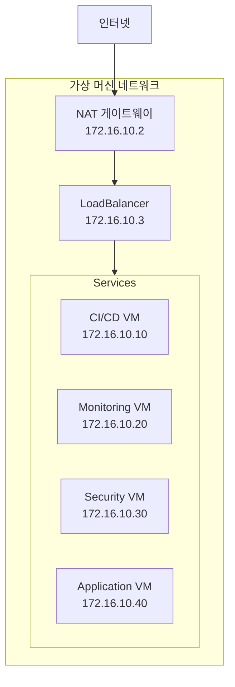
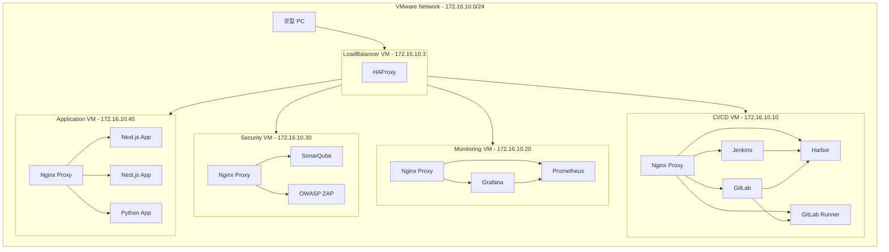

개인 PC 에 vmware 설치 이후에 가상화 서버를 구축 한다. 
가상화 서버에 
cicd 환경
모너티링 환경
msa 프로그램 서비스 환경 - 코드 검사, 보안 검사 
    - 샘플 도커프로그램 [next.js , nest.js , python] 각각에 데모 프로그램을 작성한다. 
을 도커컴포즈로 운영 할수 있어야 한다. 

모든 서비스는 도메인으로 접속 할수 있어야 하고 https 통신이 가능하도록 인증서를 생성해서 설치 한다. [서비스.local ]

기준으로 내 PC에 환경을 구축하려고 할때 
전체 시스템 구성도 , 도컴컴포즈 목록을 작성해

# MSA 개발 환경 시스템 구성도

## 1. 시스템 개요
개인 개발자 PC에 VMware를 이용하여 MSA 개발/운영 환경을 구축합니다.
모든 서비스는 HTTPS를 통해 접근 가능하며, 도메인 기반(.local)으로 운영됩니다.

## 2. 주요 기능
1. CI/CD 환경
   - 소스 코드 관리 (GitLab)
   - 자동화 파이프라인 (Jenkins)
   - 컨테이너 레지스트리 (Harbor)

2. 모니터링 환경
   - 시스템 메트릭 수집 (Prometheus)
   - 대시보드 시각화 (Grafana)

3. 보안 및 품질 관리
   - 코드 품질 분석 (SonarQube)
   - 보안 취약점 검사 (OWASP ZAP)

4. 애플리케이션 환경
   - 프론트엔드 (Next.js)
   - 백엔드 API (Nest.js)
   - 데이터 처리 (Python)

## 3. 네트워크 구성

## VM 구성
1. LoadBalancer VM (2CPU, 2GB RAM)
   - HAProxy
   - SSL 인증서 관리

2. CI/CD VM (6CPU, 12GB RAM)
   - GitLab
   - GitLab Runner
   - Jenkins
   - Harbor
   - Nginx Proxy

3. Monitoring VM (2CPU, 4GB RAM)
   - Grafana
   - Prometheus
   - Nginx Proxy

4. Security VM (2CPU, 4GB RAM)
   - SonarQube
   - OWASP ZAP
   - Nginx Proxy

5. Application VM (4CPU, 8GB RAM)
   - Next.js App
   - Nest.js App
   - Python App
   - Nginx Proxy

## 시스템 구성도

## VM 네트워크 구성
- VMware Network: 172.16.10.0/24
- LoadBalancer VM: 172.16.10.3
- CI/CD VM: 172.16.10.10
- Monitoring VM: 172.16.10.20
- Security VM: 172.16.10.30
- Application VM: 172.16.10.40

## VMware 네트워크 설정
- 네트워크 타입: NAT
- DHCP: 사용하지 않음 (고정 IP 사용)
- 서브넷: 172.16.10.0/24
- NAT 게이트웨이: 172.16.10.2

## 서비스 도메인 구성
- gitlab.local - GitLab 서버
- jenkins.local - CICD 서버
- grafana.local - 모니터링 대시보드
- sonarqube.local - 코드 품질 검사
- security.local - 보안 검사 도구
- next-demo.local - Next.js 데모
- nest-demo.local - Nest.js 데모
- python-demo.local - Python 데모
- harbor.local - 프라이빗 레지스트리

## 필요한 도구
- VMware Workstation/Player
- Docker Desktop
- mkcert (로컬 인증서 생성)
- OpenSSL (인증서 생성)

## VM 설치 요구사항
- 호스트 PC 요구사항:
  - CPU: 최소 16코어 (권장 20코어)
  - 메모리: 최소 32GB (권장 64GB)
  - 디스크: 최소 500GB
  - OS: Windows 10/11 Pro 이상
- VMware Workstation Pro 17 이상

## 5. 보안 설계
1. 네트워크 보안
   - VM 간 격리된 네트워크
   - HAProxy를 통한 SSL/TLS 종단
   - 내부 서비스 직접 접근 차단

2. 접근 제어
   - 서비스별 독립 도메인
   - HTTPS 강제 적용
   - 인증서 기반 보안

3. 모니터링
   - 실시간 시스템 모니터링
   - 로그 중앙화
   - 보안 이벤트 추적